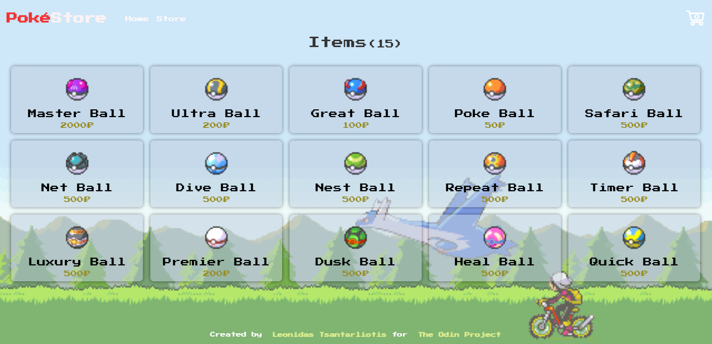

# Poké-Store

Live Demo:  
https://leo-tsant-poke-store.netlify.app/

## Overview

This project was created for the [Shopping Cart assignment](https://www.theodinproject.com/lessons/node-path-react-new-shopping-cart) as part of [The Odin Project](https://www.theodinproject.com/) curriculum. It features an application built with React that allows users to browse and purchase Pokémon items.

### Technologies Used

-   **React**
-   **React Router**
-   **PokeAPI**
-   **CSS**
